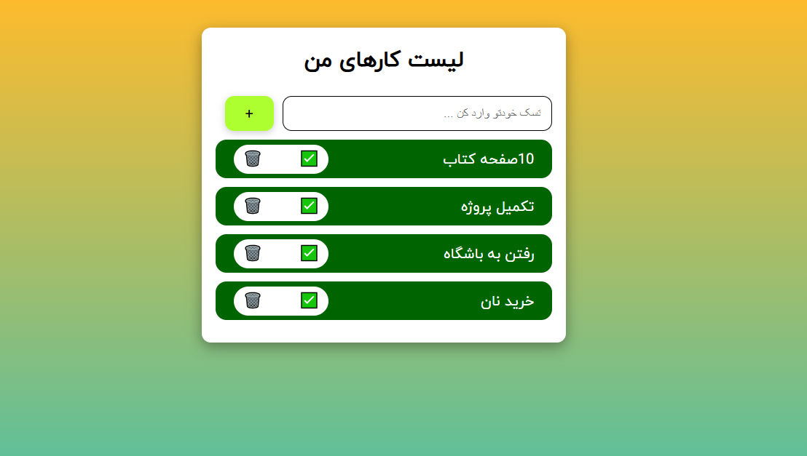

# 📝 Task Manager

A simple and lightweight task manager built with vanilla JavaScript, HTML, and CSS.  
This app allows you to add, mark as done, and delete tasks — all saved in your browser using `localStorage`.
This mini-project is built without any libraries.

---

## 🚀 Features

- Add new tasks
- Mark tasks as completed ✅
- Delete tasks 🗑️
- Persistent storage using `localStorage`
- Clean and minimal UI

---

## 📸 Preview

